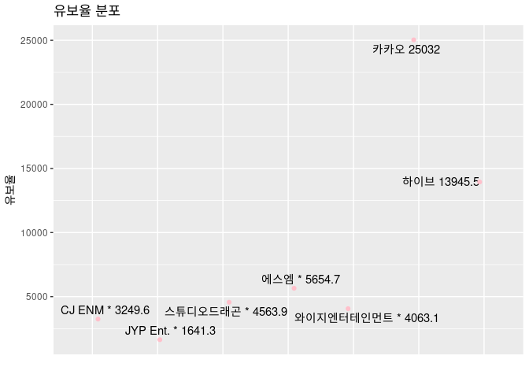
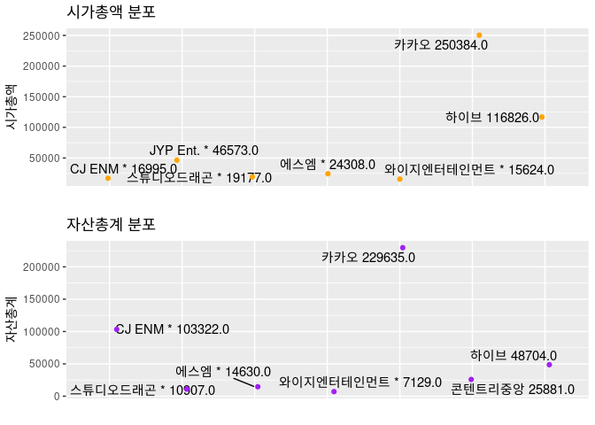
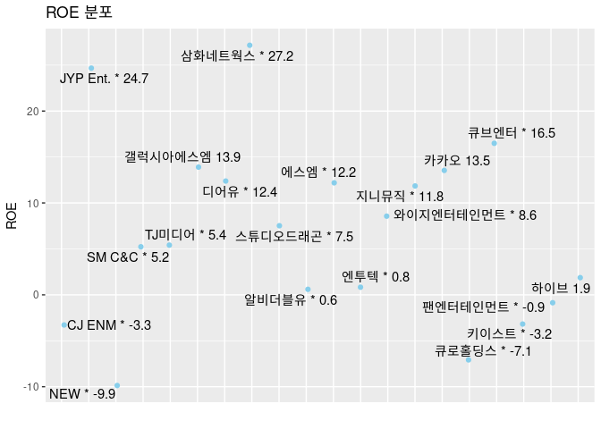
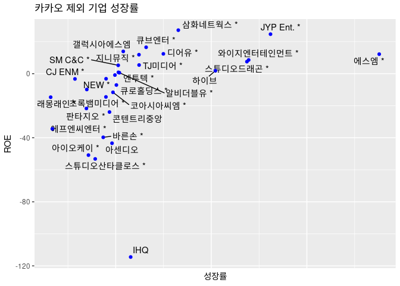
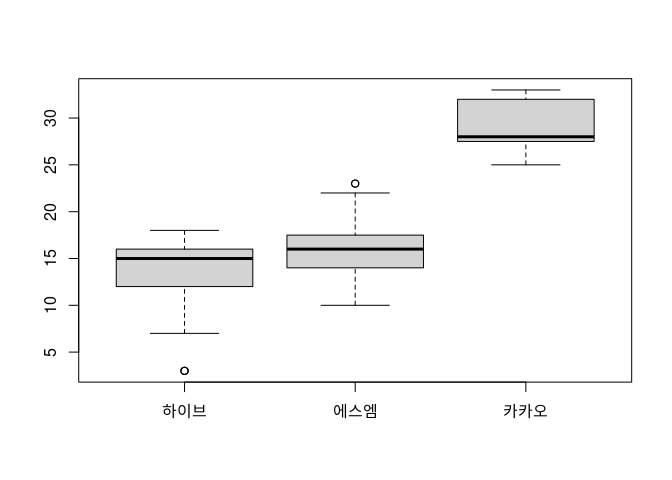
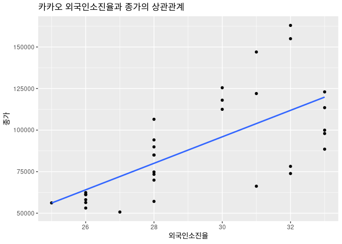

엔터테인먼트 시장분석
================
kimsubin
2023-06-10


- <a href="#1-유보율--잉여금납입자본금--100-으로-기업-내-잉여금-비율"
  id="toc-1-유보율--잉여금납입자본금--100-으로-기업-내-잉여금-비율">1.
  유보율 : (잉여금/납입자본금) * 100 으로, 기업 내 잉여금 비율</a>
- <a href="#2-roe--자기자본이익률-당기순이익자기자본-100"
  id="toc-2-roe--자기자본이익률-당기순이익자기자본-100">2. ROE :
  자기자본이익률, (당기순이익/자기자본) *100</a>
- <a href="#3-roe와-유보율-기업의-미래성장성"
  id="toc-3-roe와-유보율-기업의-미래성장성">3. ROE와 유보율 (기업의
  미래성장성)</a>
- <a href="#4-외국인비율--외국인이-보유한-주식비율"
  id="toc-4-외국인비율--외국인이-보유한-주식비율">4. 외국인비율 : 외국인이
  보유한 주식비율</a>

------------------------------------------------------------------------

#### 목차

    1. 유보율 (기업의 안전성) 
    2. ROE (기업의 자본효율성)
    3. 유보율과 ROE (기업의 미래성장성)
    4. 외국인비율 

------------------------------------------------------------------------

### 1. 유보율 : (잉여금/납입자본금) \* 100 으로, 기업 내 잉여금 비율

> **유보율이 높다 = 잉여금 즉 기업에 남는 돈이 많다** (기업의 자금
> 동원력이 크다)  
> - 자금이 많기에 **재무구조가 탄탄, 신규 사업에 유리**  
> - 보통 유보율이 1000% 이상인 기업이 초보자들이 투자하기에 적합

``` r
####유보율
enter$유보율<- gsub(",","",enter$유보율)
enter$유보율<- as.numeric(enter$유보율)
top_a <- head(enter[order(-enter$유보율), ], 7)

# 유보율 분포 시각화
ggplot(top_a, aes(x = 종목명, y = 유보율, label = paste(종목명,유보율))) +
  geom_text_repel() +
  geom_jitter(width = 0.1, height = 0, color = "pink") +
  labs(title = "유보율 분포", x = "", y = "유보율") +
  theme(axis.text.x = element_blank(), axis.ticks.x = element_blank())
```

<!-- -->

##### 상관관계 분석 (with 해당기업의 규모와 가치를 나타내는 지표들)

##### 시가총액 : 회사 총 주식 가격들 합친 금액(종목의 발행주식수 \* 종목 주가)

##### 자산총계 : 총 자산 (자산 = 부채+ 자본)

``` r
############# 상관 분석
correlation <- cor(enter[, c("시가총액", "유보율", "자산총계")])
print(correlation)
```

    ##           시가총액    유보율  자산총계
    ## 시가총액 1.0000000 0.9724027 0.8889949
    ## 유보율   0.9724027 1.0000000 0.8737471
    ## 자산총계 0.8889949 0.8737471 1.0000000

<!-- -->

``` r
number <- cbind(top_a$종목명 ,top_c$종목명, top_d$종목명)
colnames(number) <- c("유보율", "시가총액", "자본총액")
print(number)
```

    ##      유보율                 시가총액               자본총액              
    ## [1,] "카카오"               "카카오"               "카카오"              
    ## [2,] "하이브"               "하이브"               "CJ ENM *"            
    ## [3,] "에스엠 *"             "JYP Ent. *"           "하이브"              
    ## [4,] "스튜디오드래곤 *"     "에스엠 *"             "콘텐트리중앙"        
    ## [5,] "와이지엔터테인먼트 *" "스튜디오드래곤 *"     "에스엠 *"            
    ## [6,] "CJ ENM *"             "CJ ENM *"             "스튜디오드래곤 *"    
    ## [7,] "JYP Ent. *"           "와이지엔터테인먼트 *" "와이지엔터테인먼트 *"

- 유보율이 높을수록, 자산총계와 시가총액이 높은 기업이라고 짐작해볼 수
  있다.  
- 재무구조가 튼튼한 기업들 확인 : 카카오, 하이브, SM, 스튜디오드래곤, CJ
  ENM, YG, JYP

------------------------------------------------------------------------

### 2. ROE : 자기자본이익률, (당기순이익/자기자본) \*100

> 기업이 가진 자본 활용해 수익 얼마나 창출했는지  
> - 즉 내가 가진 자본으로 번 순이익  
> - **ROE 높다 = 기업의 수익창출능력, 자본활용능력 좋다**

``` r
enter$ROE <- as.numeric(enter$ROE)
top_0 <- head(enter[order(-enter$ROE), ], 20)

ggplot(top_0, aes(x = 종목명, y = ROE, label = sprintf("%s %.1f", 종목명, ROE))) +
  geom_text_repel() +
  geom_jitter(width = 0.1, height = 0, color = "skyblue") +
  labs(title = "ROE 분포", x = "", y = "ROE") +
  theme(axis.text.x = element_blank(), axis.ticks.x = element_blank())
```

<!-- -->

- 수익창출능력 높은 기업들 :JYP, 삼화네트웍스, 디어유, 갤럭시아에스엠,
  큐브엔터, YG

------------------------------------------------------------------------

### 3. ROE와 유보율 (기업의 미래성장성)

> 성장률 = ROE \* 유보율  
> – 기업이 지속적으로 유지할 수 있는 성장률: 유보율 × 자기자본이익률

``` r
enter$성장률 <- enter$ROE *enter$유보율
top_00 <- enter[order(-enter$성장률), ][-1, ]
print(top_00)
```

    ## # A tibble: 32 × 11
    ##    종목명      현재가 전일비 등락률 시가…¹ 자산총계 부채…² 외국인…³   ROE 유보율
    ##    <chr>        <dbl>  <dbl> <chr>   <dbl>    <dbl>  <dbl>    <dbl> <dbl>  <dbl>
    ##  1 카카오       56400    100 -0.18% 250384   229635  94316    25.9  13.5  25032 
    ##  2 에스엠 *    102000   1400 -1.35%  24308    14630   5769    14.0  12.2   5655.
    ##  3 JYP Ent. *  131200   2900 +2.26%  46573     4111   1066    46.3  24.7   1641.
    ##  4 와이지엔터…  83700   1800 +2.20%  15624     7129   1866    20.3   8.56  4063.
    ##  5 스튜디오드…  63800    100 +0.16%  19177    10907   4299     8.54  7.52  4564.
    ##  6 하이브      280500  12500 +4.66% 116826    48704  19418    18.3   1.87 13946.
    ##  7 삼화네트웍…   2725     35 +1.30%   1176      833    254     2.75 27.2    603.
    ##  8 디어유 *     41050   2950 +7.74%   9737     1525    113     2.58 12.4   1007.
    ##  9 큐브엔터 *   21400    150 +0.71%   2954     1059    666     6.69 16.5    482.
    ## 10 TJ미디어 *    7800     30 +0.39%   1087     1348    495     2.71  5.41  1130.
    ## # … with 22 more rows, 1 more variable: 성장률 <dbl>, and abbreviated variable
    ## #   names ¹​시가총액, ²​부채총계, ³​외국인비율

``` r
top_1 <- enter[order(-enter$성장률), ][-c(1, 2), ] #1등 카카오 제거

ggplot(top_1, aes(x = 성장률, y = ROE, label = 종목명)) +
  geom_text_repel() +
  geom_jitter(width = 0.1, height = 0, color = "BLUE") +
  labs(title = "카카오 제외 기업 성장률", x = "성장률", y = "ROE") +
  theme(axis.text.x = element_blank(), axis.ticks.x = element_blank())
```

    ## Warning: Removed 1 rows containing missing values (geom_text_repel).

    ## Warning: Removed 1 rows containing missing values (geom_point).

    ## Warning: ggrepel: 2 unlabeled data points (too many overlaps). Consider
    ## increasing max.overlaps

<!-- -->

- 성장률이 높은 기업 : 카카오, 에스엠, JYP, YG, 스튜디오드래곤, 하이브,
  삼화네트웍스 등

------------------------------------------------------------------------

### 4. 외국인비율 : 외국인이 보유한 주식비율

    ## 
    ## Attaching package: 'jsonlite'

    ## The following object is masked from 'package:purrr':
    ## 
    ##     flatten

> 외국인 비율이 정말 종가에 영향을 미치나?  
> - 하이브, 에스엠, 카카오 외국인소진율  
> - 4년 월별 데이터로 분석

``` r
# 데이터 이름 설정
names <- c("하이브", "에스엠", "카카오")

# boxplot 그리기
boxplot(dt_hi_m$외국인소진율, dt_sm_m$외국인소진율, dt_kko_m$외국인소진율, names = names)
```

<!-- -->

- 카카오가 외국인 비율 가장 높다
- 그렇다면 이 비율이 종가에 영향을 미치나?

``` r
cor(dt_kko_m$외국인소진율, dt_kko_m$종가)
```

    ## [1] 0.6687497

``` r
# 데이터프레임 생성
df <- data.frame(외국인소진율 = dt_kko_m$외국인소진율, 종가 = dt_kko_m$종가)

# 산점도 그래프 생성
ggplot(df, aes(x = 외국인소진율, y = 종가)) +
  geom_point() +
  geom_smooth(method = "lm", se = FALSE) +
  labs(x = "외국인소진율", y = "종가") +
  ggtitle("카카오 외국인소진율과 종가의 상관관계")
```

    ## `geom_smooth()` using formula 'y ~ x'

<!-- -->

- 상관관계 0.6687497이며, 그래프 그려본 결과 우상향하는 모양
- 외국인소진율이 종가에 +영향 미친다고 볼 수 있다.
